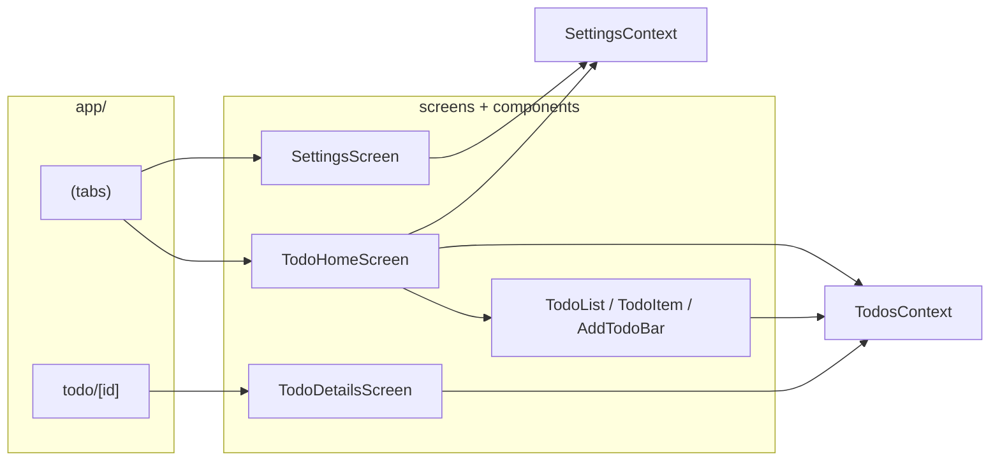

# Project map — todo-app

Quick orientation for this repository. Deeper narrative lives in `docs/CODEBASE_MAP.md`.

## What it is

Cross-platform **todo list** app: **Expo SDK ~54**, **React Native**, **expo-router** (tabs + stack), **TypeScript**. Todo data is **in-memory** only (React Context); it resets when the app restarts. **App settings** (appearance, list options, haptics) persist via AsyncStorage.

## Stack

| Layer | Choice |
|--------|--------|
| Runtime | Expo, `expo-router/entry` (`package.json` `main`) |
| Navigation | Root `Stack` + `Tabs` in `app/(tabs)/_layout.tsx`; routes under `app/` |
| State | `TodosProvider` + `useTodos()`; `SettingsProvider` + `useSettings()` |
| Theming | `ThemeProvider` resolves light/dark from **settings** or system `useColorScheme` |
| Animation | `react-native-reanimated` (e.g. details screen) |

Path alias: `@/*` → repo root (`tsconfig.json`).

## Routes (expo-router)

| URL / segment | File | Screen |
|----------------|------|--------|
| `/` (tabs, default tab) | `app/(tabs)/index.tsx` | `TodoHomeScreen` |
| `/settings` | `app/(tabs)/settings.tsx` | `SettingsScreen` |
| `/todo/:id` | `app/todo/[id].tsx` | `TodoDetailsScreen` |

Root shell: `app/_layout.tsx` wraps **SettingsProvider** → **ThemeProvider** (from settings/system) → **TodosProvider** → **Stack** (`(tabs)` + `todo/[id]`) → `StatusBar`.

## Source layout

```
app/                    # Routes only (thin wrappers → screens/)
  _layout.tsx
  (tabs)/
    _layout.tsx         # Tab navigator
    index.tsx
    settings.tsx
  todo/[id].tsx
screens/                # Full-screen UI
  todo-home-screen.tsx
  todo-details-screen.tsx
  settings-screen.tsx
components/todos/       # List, row, add bar
  add-todo-bar.tsx
  todo-list.tsx
  todo-item.tsx
context/
  todos-context.tsx     # add / update / delete / getTodo
  settings-context.tsx  # appearance, list prefs, haptics; AsyncStorage
types/
  todo.ts               # Todo type
hooks/                  # useColorScheme (+ .web), useThemeColor
constants/
  theme.ts              # Color tokens (used with hooks)
```

## Data model

`types/todo.ts`: `id`, `title`, `note`, `completed`, `createdAt`. IDs are generated in context (`Date.now()` + random segment).

## Flow (mental model)



## Commands

- `npm run start` — Expo dev server  
- `npm run ios` / `npm run android` / `npm run web` — platform targets  
- `npm run lint` — ESLint (Expo config)

## Config worth knowing

- `app.json` — Expo app config  
- `eas.json` — EAS Build profiles  
- `expo-env.d.ts` — Expo TypeScript references  

## Related docs

- `docs/CODEBASE_MAP.md` — longer module-by-module description.
