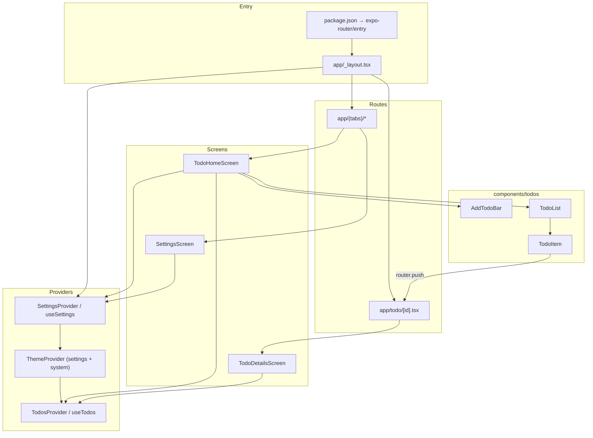

# Codebase map

## Overview

**todo-app** is an Expo (SDK ~54) React Native application using **expo-router** for file-based navigation, **React Navigation** themes, and in-memory todo state via React Context. TypeScript is strict; imports use the `@/*` path alias to the repository root.

## Entry points

| Kind | Location | Role |
|------|----------|------|
| **Package entry** | `package.json` → `"main": "expo-router/entry"` | Boots Expo and the router. |
| **Root layout** | `app/_layout.tsx` | `SettingsProvider`; inner tree applies `ThemeProvider` (from settings + system scheme), `TodosProvider`, root `Stack`, `StatusBar`. |
| **Tabs layout** | `app/(tabs)/_layout.tsx` | Bottom tabs: Todos + Settings. |
| **Todos tab** | `app/(tabs)/index.tsx` | Renders `TodoHomeScreen`. |
| **Settings tab** | `app/(tabs)/settings.tsx` | Renders `SettingsScreen`. |
| **Detail route** | `app/todo/[id].tsx` | Renders `TodoDetailsScreen`; dynamic segment `id`. |

There is no custom `index.js`; Expo Router owns bootstrap.

## Directory structure

```
todo-app/
├── app/                    # expo-router routes (thin route components)
│   ├── _layout.tsx
│   ├── (tabs)/
│   │   ├── _layout.tsx
│   │   ├── index.tsx
│   │   └── settings.tsx
│   └── todo/[id].tsx
├── screens/                # full-screen views
├── components/todos/       # todo-specific UI pieces
├── context/                # React context (app state)
├── types/                  # shared TypeScript types
├── hooks/                  # theme / color scheme helpers
├── constants/              # theme tokens (used by hooks)
├── docs/                   # architecture docs (this file)
├── .cursor/
│   ├── rules/              # Cursor agent rules
│   └── skills/Cartograph/
├── app.json, eas.json
├── package.json, tsconfig.json
└── expo-env.d.ts
```

## Major modules

### `app/` (routing shell)

- **`_layout.tsx`**: `SettingsProvider` at the outermost level; `RootNavigation` resolves appearance (`system` | `light` | `dark`), then `ThemeProvider`, `TodosProvider`, and a root `Stack` with `(tabs)` (no header) and `todo/[id]`.
- **`(tabs)/_layout.tsx`**: `Tabs` from expo-router; icons via `@expo/vector-icons` (Ionicons); Todos and Settings screens.
- **`(tabs)/index.tsx`**: Default tab; delegates to `TodoHomeScreen`.
- **`(tabs)/settings.tsx`**: Settings tab; delegates to `SettingsScreen`.
- **`todo/[id].tsx`**: Stack modal-style detail route; delegates to `TodoDetailsScreen`.

### `screens/`

- **`todo-home-screen.tsx`**: List experience—`SafeAreaView`, `AddTodoBar`, `TodoList`; uses `useTodos` and `useSettings`; filters out completed todos when `hideCompletedTodos` is on; optional `expo-haptics` on toggle when enabled; calls `updateTodo` for completion.
- **`todo-details-screen.tsx`**: Reads `id` from `useLocalSearchParams`, loads todo via `getTodo`, syncs local `title`/`note` state, save and delete actions, `router.back()` if id missing or todo not found; uses Reanimated for button feedback; custom `Stack.Screen` options in-component.
- **`settings-screen.tsx`**: Appearance chips (system / light / dark), switches for hide-completed and haptics, reset-to-defaults; reads/writes via `useSettings()`.

### `components/todos/`

- **`add-todo-bar.tsx`**: Input + submit to create todos (calls parent `onAdd`).
- **`todo-list.tsx`**: Maps `todos` to `TodoItem`.
- **`todo-item.tsx`**: Row UI, completion toggle, navigates to `/todo/[id]` via `router.push`.

### `context/todos-context.tsx`

- **`TodosProvider`**: Holds `Todo[]` in `useState`; `addTodo`, `updateTodo`, `deleteTodo`, `getTodo`.
- **`useTodos`**: Consumer hook; throws if used outside provider.

### `context/settings-context.tsx`

- **`SettingsProvider`**: Loads and saves `AppSettings` with `@react-native-async-storage/async-storage` (`appearance`, `hideCompletedTodos`, `hapticsEnabled`); exposes setters and `resetSettings`.
- **`useSettings`**: Consumer hook; throws if used outside provider.

### `types/todo.ts`

- Defines `Todo`: `id`, `title`, `note`, `completed`, `createdAt`.

### `hooks/` and `constants/`

- **`use-color-scheme` / `use-color-scheme.web`**: Platform-aware appearance.
- **`use-theme-color.ts`**: Maps semantic roles to `Colors` from `constants/theme.ts`.

## Data flow and state

- **Single source of truth (todos)**: `TodosProvider` wraps navigated routes (inside `ThemeProvider`), so home and detail share the same in-memory list.
- **Settings**: `SettingsProvider` wraps the whole navigation tree; theme resolution in `RootNavigation` reads `useSettings()` and `useColorScheme()` for the active navigation theme.
- **Creates**: `AddTodoBar` → `addTodo` → new `Todo` appended.
- **Reads / updates**: `TodoList` / `TodoDetailsScreen` read from context; detail screen patches `title`, `note`, `completed` via `updateTodo`.
- **Deletes**: Detail screen calls `deleteTodo` then navigates back.
- **Persistence**: Todos remain in-memory only. Settings persist across restarts via AsyncStorage.

## Important relationships



**Navigation**: `TodoItem` uses `expo-router` `router.push` to `/todo/${todo.id}`. Detail uses `useLocalSearchParams` for `id` and `router.back()` on invalid or deleted state.

## Configuration

| File | Notes |
|------|--------|
| `tsconfig.json` | `strict: true`; `paths`: `@/*` → `./*`. |
| `app.json` | Expo app id, scheme, orientation, etc. |
| `eas.json` | EAS Build / Submit profiles if used. |

## Maintenance

Regenerate or refresh maps with the **Cartograph** project skill (`.cursor/skills/Cartograph/SKILL.md`): mention Cartograph or ask for an updated repository / project map; the agent should refresh this file and `.cursor/project-map.md` together when structure changes.
